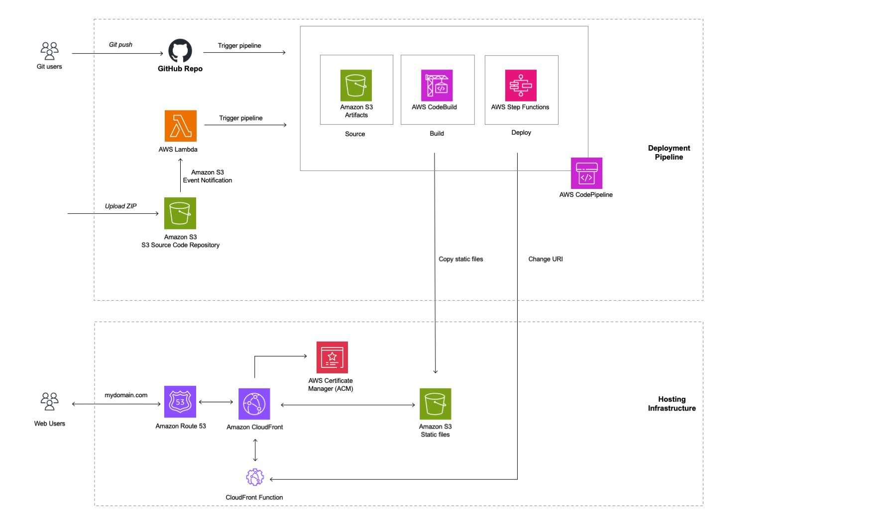

# CloudFront Hosting Toolkit

CloudFront Hosting Toolkit is an open-source command-line tool designed to simplify the deployment and management of fast, secure frontend applications on AWS. It offers the convenience of a managed frontend hosting service while giving developers full control over their hosting and deployment infrastructure.

## What is CloudFront Hosting Toolkit?

CloudFront Hosting Toolkit is a comprehensive solution that automates the process of setting up and managing a robust, scalable frontend hosting infrastructure on AWS. It leverages several AWS services, including CloudFront, S3, CodePipeline, and Lambda, to create a powerful hosting environment tailored for modern web applications.

Key features include:
- Automated setup of AWS resources for frontend hosting
- Continuous deployment pipeline for GitHub and S3-based workflows
- Optimized content delivery through CloudFront
- Built-in security features including HTTPS and security headers
- Custom domain support with automatic SSL/TLS certificate management
- Flexible configuration options for various frontend frameworks

## How It Works

CloudFront Hosting Toolkit streamlines the deployment process in the following ways:

1. **Initialization**: Run `cloudfront-hosting-toolkit init` to set up your project. The tool detects your project settings and guides you through the configuration process.

2. **Infrastructure Setup**: The toolkit automatically provisions and configures necessary AWS resources, including S3 buckets, CloudFront distributions, and CodePipeline workflows.

3. **Deployment**: When you run `cloudfront-hosting-toolkit deploy`, the following happens:
   - For GitHub sources: Changes pushed to your repository trigger the CodePipeline.
   - For S3 sources: Uploading a ZIP file to a specified S3 bucket initiates the deployment.
   - The build process compiles your code and creates deployment artifacts.
   - Artifacts are uploaded to a hosting S3 bucket in a version-specific folder.
   - A CloudFront Function is updated to route traffic to the new version.

4. **Content Delivery**: CloudFront serves your content from edge locations, ensuring fast global access.

5. **Updates and Maintenance**: Subsequent deployments follow the same process, with automatic cache invalidation to ensure immediate updates.

## Why Use CloudFront Hosting Toolkit?

- **Simplicity**: Deploy complex frontend hosting setups with just a few commands.
- **Speed**: Leverage CloudFront's global CDN for fast content delivery.
- **Security**: Automatic HTTPS configuration and security headers.
- **Flexibility**: Support for various frontend frameworks and deployment sources.
- **Cost-Effective**: Utilize AWS services efficiently without unnecessary overhead.
- **Full Control**: Retain the ability to customize and extend your infrastructure.

## Getting Started

### Prerequisites

- Node.js 18+
- AWS CLI 2+ configured with your AWS account
- (Optional) A GitHub account for GitHub-based deployments

### Installation

```bash
npm install -g @aws/cloudfront-hosting-toolkit
```

### Quick Start

1. Initialize your project:
   ```bash
   cloudfront-hosting-toolkit init
   ```

2. Deploy your website:
   ```bash
   cloudfront-hosting-toolkit deploy
   ```

For more detailed instructions, see our [Getting Started with CLI](#getting-started-with-the-cli) section.

## Advanced Usage

CloudFront Hosting Toolkit offers flexibility in how it can be used:

- **CLI**: Use the Command-Line Interface for a straightforward, step-by-step deployment process.
- **CDK Construct**: Leverage the CloudFront Hosting Toolkit as a ready-made L3 CDK construct for seamless integration into your AWS CDK projects.
- **CDK Source Code**: Customize the CDK source code to tailor the infrastructure to your specific requirements.

For advanced usage scenarios and in-depth configurations, please refer to the [Advanced Usage Guide](docs/advanced-usage.md).

## Architecture



CloudFront Hosting Toolkit sets up a comprehensive AWS architecture for your frontend hosting:

- **Source Control**: GitHub repository or S3 bucket
- **CI/CD**: AWS CodePipeline for automated builds and deployments
- **Build Process**: AWS CodeBuild for compiling and creating deployment artifacts
- **Storage**: S3 buckets for hosting website files
- **Content Delivery**: CloudFront for global content distribution
- **Routing**: CloudFront Functions for request handling and routing
- **Orchestration**: Step Functions for managing deployment processes
- **State Management**: DynamoDB for storing deployment state information

This architecture ensures a scalable, performant, and maintainable hosting solution for your frontend applications.

## Documentation

- [CLI Guide](docs/cli-guide.md)
- [CDK Integration](docs/cdk-integration.md)
- [Troubleshooting Guide](docs/troubleshooting.md)
- [FAQ](docs/faq.md)
- [Contributing Guidelines](CONTRIBUTING.md)

## License

This library is licensed under the Apache-2.0 License.